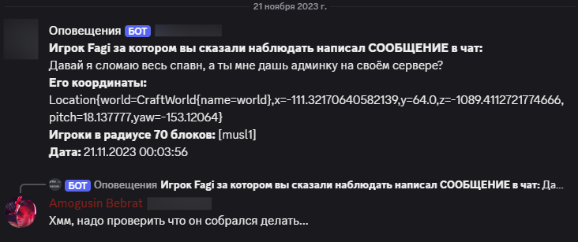

# GusKeepEye - Player Monitoring Plugin

Minecraft plugin for monitoring suspicious players. Tracks chat messages, commands, coordinates, and nearby players. Logs detailed reports to Discord via webhook.

## Key Features

- Real-time monitoring of specified players
- Discord webhook integration with rich message formatting
- Location tracking and nearby player detection
- Customizable datetime formatting
- LiteBans API integration for moderation context

## Example of sending content to discord (in Russian configuration)



## Technical Implementation

- **Event-Driven Architecture**  
  Uses Spigot's event system to capture player actions  
  [Spigot Event API Docs](https://hub.spigotmc.org/javadocs/spigot/org/bukkit/event/package-summary.html)
- **Asynchronous Webhooks**  
  Non-blocking Discord messaging using Java's HttpURLConnection  
  [HttpURLConnection Docs](https://docs.oracle.com/javase/8/docs/api/java/net/HttpURLConnection.html)
- **Dynamic String Formatting**  
  Flexible message templates with replaceable parameters  
  [Java String Formatting](https://docs.oracle.com/javase/8/docs/api/java/util/Formatter.html)
- **YAML Configuration**  
  Simple user setup through config.yml files  
  [Spigot Configuration Guide](https://www.spigotmc.org/wiki/config-files/)

## Core Technologies

- **[Spigot API](https://www.spigotmc.org/wiki/spigot/)**  
  Minecraft server modification API
- **[LiteBans](https://gitlab.com/ruany/LiteBans/-/wikis/Permissions)**  
  Lightweight ban management system
- **[Discord Webhooks](https://discord.com/developers/docs/resources/webhook)**  
  Discord's message delivery system
- **[Java SimpleDateFormat](https://docs.oracle.com/javase/8/docs/api/java/text/SimpleDateFormat.html)**  
  Custom datetime formatting

## Project Structure

```
guskeepeye/
├── src/
│   └── main/
│       ├── java/
│       │   └── me/gusandr/guskeepeye
│       │       └── events/        # Event
│       │              └── Event        # Event handlers
│       │       ├── Plugin.java   # Main plugin class
│       └── resources/
│           ├── config.yml            # Plugin configuration
│           └── plugin.yml            # Plugin metadata
└── pom.xml                           # Project dependencies
```

### Directory Details
- `events/`: Handles chat/command events and player tracking
- `resources/`: Stores user-editable configuration files

## Configuration

```yaml
discord:
  message: "**Player %s whom you said to watch wrote %s in the chat:**\n%s\n**His coordinates:** %s\n**Players within a 70 block radius:** %s\n**Date:**%s"
url: "" # Link to discord's webhook

players-under-surveillance:
  - "Phages"
  - "musl1"
# - "" and so on

date-format: "dd.MM.yyyy HH:mm:ss"
```
